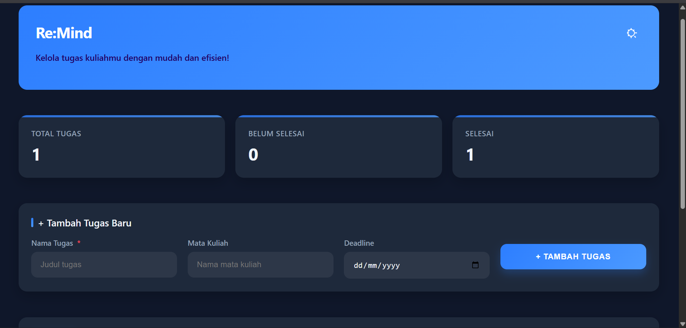

# 🚀 Re:Mind - Pengelola Tugas Kuliah

[](https://opensource.org/licenses/MIT)
[%20%7C%20CSS3%20%7C%20HTML5-blueviolet)](https://developer.mozilla.org/)
[](https://github.com/)

**Re:Mind** adalah aplikasi web *to-do list* modern yang dirancang khusus untuk membantu mahasiswa mengelola dan melacak semua tugas kuliah mereka. Dengan antarmuka yang bersih, responsif, dan dukungan mode terang/gelap, Re:Mind memudahkan Anda untuk tetap teratur dan tidak pernah melewatkan tenggat waktu.

Aplikasi ini dibangun dengan JavaScript modern (ES6+), memanfaatkan fitur-fitur seperti `class`, `async/await`, dan `Promise` untuk manajemen data yang efisien, serta menyimpan semua tugas dengan aman di `localStorage` browser Anda.

## ✨ Fitur Utama

* **📝 Tambah & Kelola Tugas:** Catat tugas baru dengan cepat, lengkap dengan nama mata kuliah dan tenggat waktu.
* **🔄 Statistik Real-time:** Dashboard utama menampilkan ringkasan jumlah total tugas, tugas yang belum selesai, dan yang sudah selesai.
* **✅ Tandai Selesai:** Tandai tugas sebagai selesai (atau batalkan) dengan satu klik.
* **🗑️ Hapus Tugas:** Hapus tugas yang sudah tidak relevan lagi.
* **🔍 Filter & Pencarian:** Saring daftar tugas berdasarkan status (Semua, Belum Selesai, Selesai) dan cari tugas secara dinamis berdasarkan judul atau mata kuliah.
* **📑 Paginasi:** Halaman diatur secara otomatis untuk mengelola daftar tugas yang panjang agar tetap rapi.
* **🌗 Mode Terang & Gelap:** Beralih tema secara manual atau biarkan aplikasi mengikuti preferensi sistem Anda.
* **💾 Penyimpanan Lokal:** Semua tugas Anda disimpan di `localStorage` browser, sehingga data tidak hilang saat Anda me-refresh halaman.
* **📱 Desain Responsif:** Tampilan yang optimal di perangkat desktop maupun seluler.

## 📸 Tampilan Aplikasi (Screenshot)

<table align="center" cellspacing="0" cellpadding="0">
  <tr>
    <td align="center">
      <strong>Mode Gelap (Tampilan Utama)</strong><br>
      
    </td>
    <td align="center">
      <strong>Mode Terang (Form Tambah Tugas)</strong><br>
      
    </td>
  </tr>
  <tr>
    <td colspan="2" align="center">
      <br><strong>Daftar Tugas & Fitur Filter/Paginasi</strong><br>
      
    </td>
  </tr>
</table>

## 🛠️ Fitur ES6+ & Teknologi yang Digunakan

Proyek ini ditulis dari awal (vanilla) tanpa *framework* eksternal dan secara ekstensif mengimplementasikan fitur-fitur JavaScript modern (ES6+).

### JavaScript (ES6+)

* **`class`**: Kode diorganisir secara Object-Oriented Programming (OOP) menggunakan tiga kelas utama:
    * `TaskManager`: Mengelola logika bisnis dan data (tambah, hapus, filter, simpan ke `localStorage`).
    * `UI`: Mengelola semua rendering dan manipulasi DOM.
    * `ThemeManager`: Mengelola pergantian tema (terang/gelap) dan deteksi preferensi sistem.
* **`async / await`**: Digunakan pada semua metode yang berinteraksi dengan `localStorage` (seperti `save()`, `addTask()`, `removeTask()`) untuk mensimulasikan operasi asinkron dan membuat kode lebih bersih.
* **`Promise`**: Digunakan dalam metode `save()` untuk membungkus operasi `localStorage.setItem()`.
* **`const` dan `let`**: Digunakan untuk deklarasi variabel dengan *scope* yang tepat, menggantikan `var`.
* **Arrow Functions (`=>`)**: Digunakan secara ekstensif untuk *event listener* dan metode *array* (seperti `.filter()`, `.find()`, `.map()`, `.forEach()`).
* **Template Literals ( `` `...` `` )**: Digunakan untuk membuat string HTML dinamis dengan cara yang lebih mudah dibaca.
* **Spread Syntax (`...`)**: Digunakan dalam `getTasks()` untuk mengembalikan salinan *array* tugas, bukan referensi aslinya, untuk menjaga *immutability*.
* **Default Parameters**: Digunakan dalam fungsi untuk memberikan nilai *default* (misal: `name: name || ''`).
* **`window.matchMedia`**: Digunakan di `ThemeManager` untuk mendeteksi preferensi mode gelap (`prefers-color-scheme: dark`) dari sistem operasi pengguna.

### HTML5 & CSS3

* **HTML Semantik**: Penggunaan tag seperti `<header>`, `<section>`, dan `<nav>` (implisit melalui struktur).
* **CSS Variables (Custom Properties)**: Digunakan secara masif untuk *theming*. Tema terang dan gelap diimplementasikan hanya dengan mengubah nilai variabel CSS di bawah atribut `[data-theme="dark"]`.
* **CSS Flexbox & Grid**: Digunakan untuk membangun layout utama yang responsif dan rapi.
* **Media Queries**: Digunakan untuk memastikan aplikasi terlihat baik di layar yang lebih kecil (desain responsif).

## 🚀 Cara Menjalankan

Karena ini adalah proyek *front-end* murni (HTML, CSS, JS), Anda tidak memerlukan *build tools* atau server.

1.  **Clone repositori ini:**
    ```bash
    git clone [https://github.com/USERNAME/NAMA-REPO.git](https://github.com/USERNAME/NAMA-REPO.git)
    ```
2.  **Buka file `index.html`:**
    Cukup klik dua kali file `index.html` di *file explorer* Anda, dan proyek akan terbuka langsung di browser *default* Anda.

---

## 👨‍💻 Data Mahasiswa

| Nama                | NIM         | Kelas |
| ------------------- | ----------- | ----- |
| Ahmad Ali Mukti     | 123140155   | RA    |
