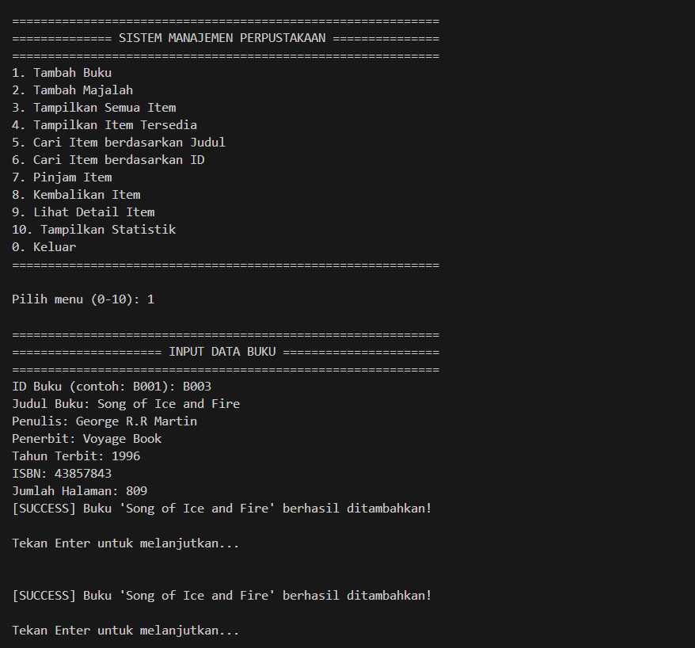
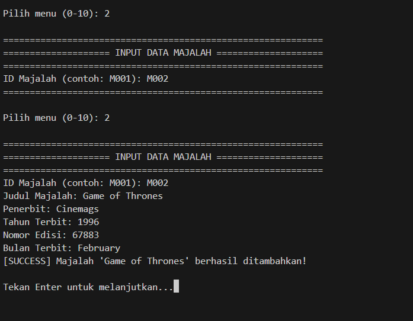
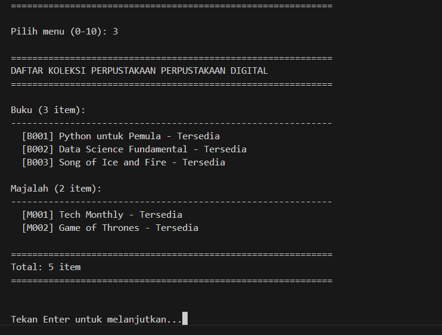
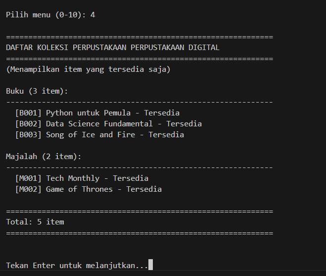
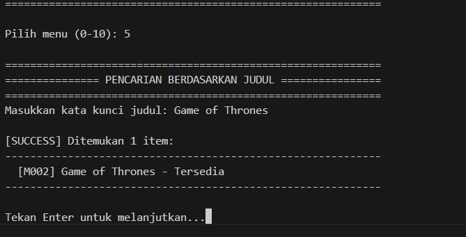
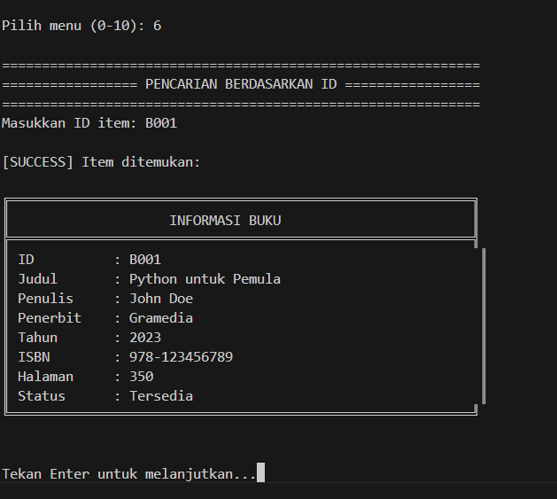
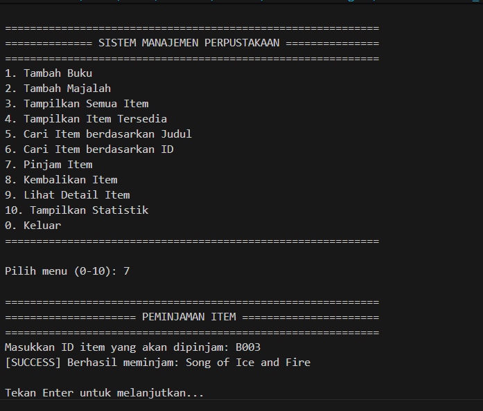
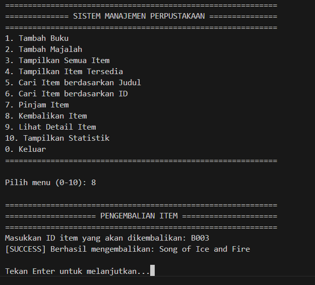
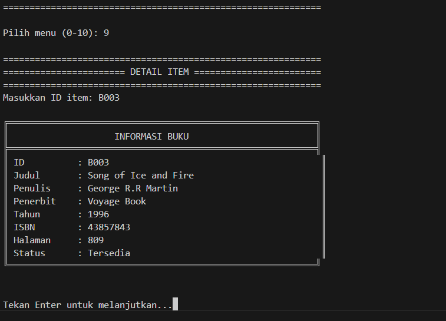
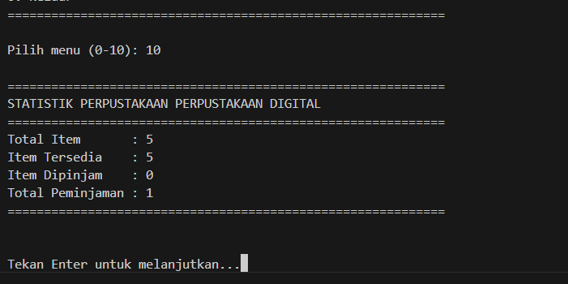

# Sistem Manajemen Perpustakaan

| Nama | NIM |
|------|-----|
| Ahmad Ali Mukti | 123140155 |

## Deskripsi
Sistem Manajemen Perpustakaan ini adalah aplikasi berbasis Python yang mengimplementasikan konsep Object-Oriented Programming (OOP) untuk mengelola koleksi perpustakaan. Sistem ini memungkinkan pengguna untuk mengelola buku dan majalah dengan berbagai fitur.

## Fitur Utama

### 1. Tambah Buku
Fitur ini memungkinkan pengguna untuk menambahkan buku baru ke dalam sistem perpustakaan dengan detail seperti:
- ID Buku
- Judul
- Penulis
- Penerbit
- Tahun Terbit
- ISBN
- Jumlah Halaman



### 2. Tambah Majalah
Memungkinkan penambahan majalah dengan informasi:
- ID Majalah
- Judul
- Penerbit
- Tahun Terbit
- Nomor Edisi
- Bulan Terbit



### 3. Tampilkan Semua Item
Menampilkan seluruh koleksi perpustakaan termasuk:
- Buku
- Majalah
- Status ketersediaan setiap item



### 4. Tampilkan Item Tersedia
Menampilkan daftar item yang tersedia untuk dipinjam.



### 5. Cari Item berdasarkan Judul
Fitur pencarian item berdasarkan kata kunci judul.



### 6. Cari Item berdasarkan ID
Pencarian spesifik menggunakan ID item.



### 7. Pinjam Item
Sistem peminjaman item dengan:
- Validasi ketersediaan
- Pencatatan status peminjaman
- Update status item



### 8. Kembalikan Item
Proses pengembalian item dengan:
- Validasi status peminjaman
- Update status ketersediaan
- Pencatatan pengembalian



### 9. Lihat Detail Item
Menampilkan informasi lengkap tentang item tertentu.



### 10. Tampilkan Statistik
Menampilkan statistik perpustakaan termasuk:
- Total item
- Item tersedia
- Item dipinjam
- Total peminjaman



## Implementasi OOP

### 1. Abstraction
- Menggunakan abstract class `LibraryItem`
- Abstract methods: `display_info()` dan `get_category()`

### 2. Inheritance
- Class `Book` dan `Magazine` mewarisi dari `LibraryItem`
- Pewarisan atribut dan method dasar

### 3. Encapsulation
- Private attributes (__)
- Protected attributes (_)
- Getter/Setter methods
- Property decorators

### 4. Polymorphism
- Override method `display_info()`
- Implementasi berbeda untuk setiap jenis item
- Penggunaan method yang sama dengan behavior berbeda

## Cara Penggunaan

1. Jalankan program dengan Python 3:
```bash
python SistemPerpustakaan.py
```

2. Pilih menu yang tersedia (0-10)
3. Ikuti instruksi yang muncul untuk setiap operasi
4. Gunakan menu 0 untuk keluar dari program

## Struktur Data
- Menggunakan List untuk penyimpanan item
- Type hints untuk memastikan type safety
- Class-based structure untuk organisasi data

## Error Handling
- Validasi input
- Try-except blocks
- Pesan error yang informatif
- Pencegahan invalid operations

## Keamanan
- Data encapsulation
- Validasi input
- Protected attributes
- Private methods untuk operasi internal