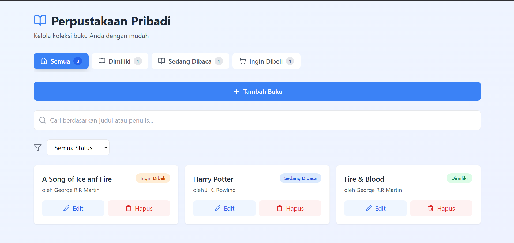
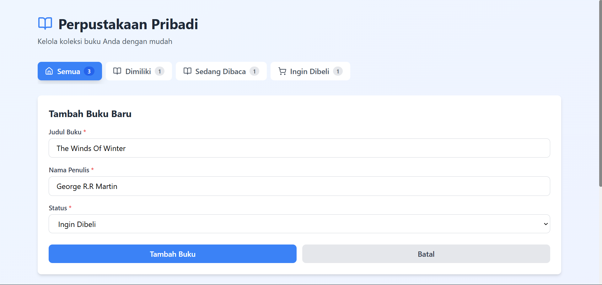
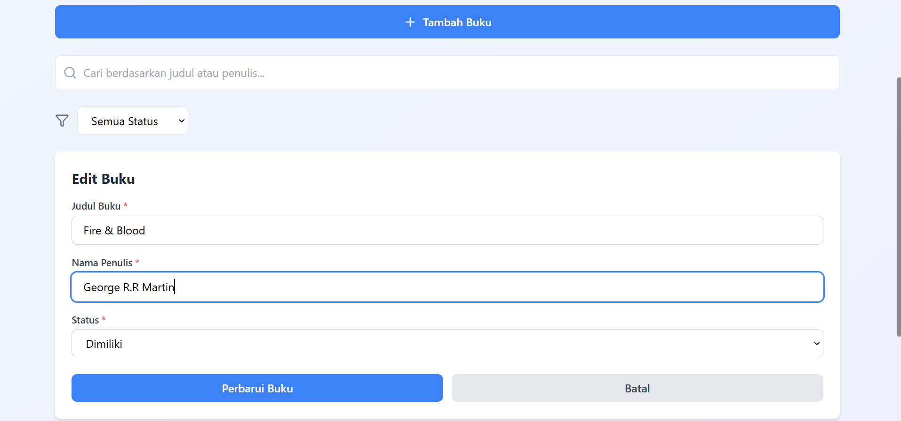

# Perpustakaan Pribadi

| Nama | Nim | Kelas |
| ---- | --- | ----- |
| Ahmad Ali Mukti | 123140155 | RA |

## Deskripsi Aplikasi

Perpustakaan Pribadi adalah aplikasi web sederhana untuk mengelola koleksi buku pribadi. Pengguna dapat menambah, mengedit, menghapus buku, mencari buku berdasarkan judul atau penulis, serta memfilter buku berdasarkan status koleksi (Dimiliki, Sedang Dibaca, Ingin Dibeli).

Fitur utama:
- Tambah, edit, hapus buku
- Pencarian buku (judul / penulis)
- Filter berdasarkan status buku
- Navigasi cepat (navigation bar) yang tersinkronisasi dengan filter

Kode utama terkait filtering berada di `src/context/BookContext.jsx` (fungsi `getFilteredBooks`) — fungsi ini menerapkan filter status dan pencarian (search query).

## Screenshot

Berikut beberapa tampilan aplikasi (disimpan di folder `SS.Doc`):

Tampilan utama:



Form tambah buku:



Form edit buku:




## Struktur Utama Project

- `src/` - kode sumber React
  - `components/` - komponen UI seperti `Navigation`, `FilterBar`, `BookList`, `BookForm`, dll.
  - `context/BookContext.jsx` - context global yang menyimpan data buku, filter, dan fungsi CRUD
  - `hooks/` - custom hooks (`useFormValidation`, `useLocalStorage`)

## Cara Instalasi (Development)

Pastikan Anda punya Node.js (v14+) dan npm terinstal.

1. Clone repository ini:

```powershell
git clone <repo-url>
cd <repo-folder>
```

2. Install dependensi:

```powershell
npm install
```

3. Jalankan development server:

```powershell
npm start
```

Server akan menjalankan aplikasi pada `http://localhost:3000` (default untuk Create React App).

## Cara Pakai (Singkat)

1. Buka aplikasi di browser setelah menjalankan `npm start`.
2. Gunakan tombol "Tambah Buku" untuk menambahkan data buku baru (judul, penulis, status wajib diisi).
3. Gunakan kolom pencarian untuk memfilter buku berdasarkan judul atau penulis.
4. Gunakan dropdown filter atau navigation bar untuk menampilkan buku berdasarkan status. Navigation dan FilterBar sudah tersinkronisasi, jadi klik navigation juga akan menerapkan filter yang sama.
5. Untuk mengedit atau menghapus buku, gunakan tombol Edit / Hapus pada kartu buku.

## Test

Jalankan unit test hook yang tersedia:

```powershell
npm test
```

File test berada di `src/tests/` untuk custom hooks.

## Catatan Teknis / Penjelasan Singkat

- State global untuk buku, pencarian, dan filter dikelola oleh `BookContext`.
- Fungsi `getFilteredBooks` di `BookContext.jsx` melakukan dua langkah filter: filter berdasarkan `filterStatus` lalu filter berdasarkan `searchQuery`.
- Navigation dan FilterBar memanggil `setFilterStatus` dan `setCurrentPage` agar tampilan dan kontrol tetap sinkron.

---

# Getting Started with Create React App

This project was bootstrapped with [Create React App](https://github.com/facebook/create-react-app).

## Available Scripts

In the project directory, you can run:

### `npm start`

Runs the app in the development mode.\
Open [http://localhost:3000](http://localhost:3000) to view it in your browser.

The page will reload when you make changes.\
You may also see any lint errors in the console.

### `npm test`

Launches the test runner in the interactive watch mode.\
See the section about [running tests](https://facebook.github.io/create-react-app/docs/running-tests) for more information.

### `npm run build`

Builds the app for production to the `build` folder.\
It correctly bundles React in production mode and optimizes the build for the best performance.

The build is minified and the filenames include the hashes.\
Your app is ready to be deployed!

See the section about [deployment](https://facebook.github.io/create-react-app/docs/deployment) for more information.

### `npm run eject`

**Note: this is a one-way operation. Once you `eject`, you can't go back!**

If you aren't satisfied with the build tool and configuration choices, you can `eject` at any time. This command will remove the single build dependency from your project.

Instead, it will copy all the configuration files and the transitive dependencies (webpack, Babel, ESLint, etc) right into your project so you have full control over them. All of the commands except `eject` will still work, but they will point to the copied scripts so you can tweak them. At this point you're on your own.

You don't have to ever use `eject`. The curated feature set is suitable for small and middle deployments, and you shouldn't feel obligated to use this feature. However we understand that this tool wouldn't be useful if you couldn't customize it when you are ready for it.

## Learn More

You can learn more in the [Create React App documentation](https://facebook.github.io/create-react-app/docs/getting-started).

To learn React, check out the [React documentation](https://reactjs.org/).

### Code Splitting

This section has moved here: [https://facebook.github.io/create-react-app/docs/code-splitting](https://facebook.github.io/create-react-app/docs/code-splitting)

### Analyzing the Bundle Size

This section has moved here: [https://facebook.github.io/create-react-app/docs/analyzing-the-bundle-size](https://facebook.github.io/create-react-app/docs/analyzing-the-bundle-size)

### Making a Progressive Web App

This section has moved here: [https://facebook.github.io/create-react-app/docs/making-a-progressive-web-app](https://facebook.github.io/create-react-app/docs/making-a-progressive-web-app)

### Advanced Configuration

This section has moved here: [https://facebook.github.io/create-react-app/docs/advanced-configuration](https://facebook.github.io/create-react-app/docs/advanced-configuration)

### Deployment

This section has moved here: [https://facebook.github.io/create-react-app/docs/deployment](https://facebook.github.io/create-react-app/docs/deployment)

### `npm run build` fails to minify

This section has moved here: [https://facebook.github.io/create-react-app/docs/troubleshooting#npm-run-build-fails-to-minify](https://facebook.github.io/create-react-app/docs/troubleshooting#npm-run-build-fails-to-minify)
